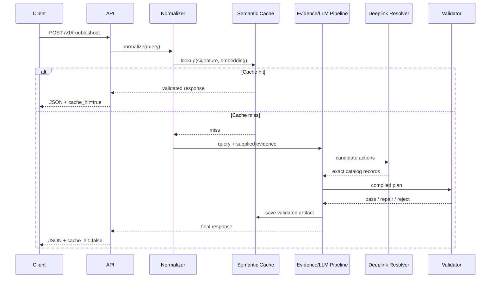

# FixGraph Technical Architecture

## 1. Architectural goals

The architecture optimizes for five things simultaneously:

1. correctness under strict schema/rule constraints,
2. precise screen/deeplink resolution,
3. evidence grounding,
4. semantic cache speed,
5. explainability during the jury demo.

## 2. High-level architecture

```mermaid
flowchart TD
    U[Client] --> API[FastAPI /v1/troubleshoot]
    API --> QN[Query Normalizer]
    QN --> CK[Case Signature Builder]
    CK --> CACHE{Semantic Cache}
    CACHE -->|validated hit| RESP[Response Serializer]
    CACHE -->|miss| EVID[Evidence Resolver]
    EVID --> EX[Structure Extractor]
    EX --> AG[Action Graph Builder]
    AG --> SR[Screen Resolver]
    SR --> DL[Deeplink Catalog Resolver]
    DL --> ORD[Risk-aware Sequencer]
    ORD --> VC[Validation Compiler]
    VC -->|pass| CW[Cache Writer]
    VC -->|repairable| RP[Deterministic Repair Pass]
    RP --> VC
    VC -->|unsafe/unrecoverable| FB[Graceful Fallback]
    CW --> RESP
    FB --> RESP
    RESP --> U

    SIIS[(SIIS/reference data)] --> EVID
    CAT[(deeplinks.json)] --> SR
    CAT --> DL
    SCHEMA[(schema.py)] --> VC
    MET[(metrics/log store)] <-- API
```

## 3. Layered design

### Layer A — API boundary

Responsibilities:

- request parsing,
- correlation ID,
- latency timer,
- error boundary,
- JSON-only response,
- `/health` readiness state.

Do not place business logic in route handlers.

### Layer B — query intelligence

Modules:

- `normalizer.py`
- `symptom_parser.py`
- `case_signature.py`
- `paraphrase.py`

Input:

```json
{
  "query": "screen flickers and battery dies fast after update",
  "siis_response": null
}
```

Internal normalized object:

```json
{
  "device": "phone",
  "domains": ["display", "battery"],
  "symptoms": ["screen_flicker", "fast_battery_drain"],
  "trigger": "post_update",
  "entities": [],
  "canonical_query": "display flicker and fast battery drain after software update",
  "signature": "phone|battery+display|fast_battery_drain+screen_flicker|post_update"
}
```

The exact taxonomy should be data-driven and extensible.

### Layer C — semantic cache

Use a persistent SQLite table plus vector representation.

Suggested schema:

```text
cache_cases
- id
- signature
- canonical_query
- embedding_blob or embedding_path
- response_json
- source_fingerprint
- catalog_fingerprint
- schema_version
- created_at
- hit_count
- validation_hash
```

A cache entry is valid only if:

- schema version matches,
- deeplink catalog fingerprint matches,
- reference-source fingerprint matches when relevant,
- validation hash is present.

#### Lookup algorithm

1. canonical signature exact match;
2. otherwise retrieve top-k semantically similar cases;
3. gate by domain compatibility;
4. gate by trigger/constraint compatibility;
5. enforce similarity threshold;
6. return only entries marked fully validated.

### Layer D — evidence resolver

If `siis_response` is present:

- use that source text first;
- segment into evidence units;
- retain offsets/spans or sentence IDs for provenance.

If it is absent:

- use only provided/pre-indexed reference assets if the challenge environment supplies them;
- otherwise a cache-only miss should fail gracefully rather than inventing guidance.

Keep provenance:

```python
EvidenceSpan(
    source_id="siis:case_017", text="...", start=123, end=211, tags=["battery", "background_apps"]
)
```

### Layer E — structure extractor

The LLM/parser should produce an **intermediate plan**, not the final API schema.

Example:

```json
{
  "topic": "Battery",
  "issue_title": "Battery fast drain",
  "candidate_actions": [
    {
      "intent": "inspect app battery usage",
      "steps": ["Open Battery settings", "Review app usage"],
      "evidence_ids": ["e7", "e8"],
      "risk_hint": "low"
    }
  ]
}
```

No deeplink is trusted from this stage.

### Layer F — Action Graph

Represent nodes:

- complaint node,
- symptom node,
- evidence node,
- candidate action node,
- screen node,
- deeplink node.

Represent edges:

- `EXPRESSES`
- `SUPPORTED_BY`
- `RESOLVES_TO_SCREEN`
- `USES_DEEPLINK`
- `PRECEDES`

This can be implemented in memory using dataclasses/networkx; no graph database is necessary.

### Layer G — screen resolver

Build an index over the **descriptive fields** of each catalog item.

Suggested concatenated retrieval document:

```text
{description}\n{message}\n{qna_description}\n{control_type}\n{classes}\n{originalType}
```

Never include masked URI text as the semantic search document.

#### Hybrid retrieval

For each candidate action:

1. BM25 top 20;
2. dense top 20;
3. reciprocal-rank or weighted fusion;
4. rule-based rerank;
5. confidence check;
6. exact screen selection.

Reject if confidence is below threshold or top candidates conflict materially.

### Layer H — deeplink catalog resolver

After a catalog record is selected:

```python
resolved_uri = catalog_record.deeplink
```

No string synthesis. No URI editing. No model-generated fallback URI.

### Layer I — action sequencer

Assign a disruption score and optional precedence constraints.

Example:

```python
risk = {
    "inspect": 0,
    "toggle": 1,
    "optimize": 2,
    "restart_app": 3,
    "reboot": 4,
    "safe_mode": 5,
    "update_or_reset": 6,
    "manual_service": 7,
}
```

Use stable sorting so equivalent actions are deterministic.

### Layer J — validation compiler

Recommended validators:

- `SchemaValidator`
- `GoalSyntaxValidator`
- `TitleValidator`
- `ScoreValidator`
- `DescriptionWordCountValidator`
- `ActionNameValidator`
- `OneScreenPerActionValidator`
- `StepImperativeValidator`
- `URLLeakValidator`
- `DeeplinkCatalogValidator`
- `ManualActionDeeplinkValidator`
- `EvidenceGroundingValidator`
- `ActionOrderValidator`
- `DuplicateActionValidator`
- `JSONOnlyValidator`

The compiler returns:

```python
ValidationReport(passed=True, errors=[], warnings=[], validation_hash="...")
```

### Layer K — deterministic repair

Only programmatic repairs are allowed after generation, for example:

- trim title to required word count,
- strip forbidden URL tokens,
- cap score to [0,1],
- normalize action category,
- reorder actions,
- deduplicate identical steps,
- replace a proposed deeplink with the selected catalog record's exact URI.

Do not invent missing semantic content during repair.

## 4. Request lifecycle



## 5. Dependency inversion

Define interfaces:

```python
class LLMProvider(Protocol): ...


class Embedder(Protocol): ...


class EvidenceStore(Protocol): ...


class DeeplinkStore(Protocol): ...


class CaseCache(Protocol): ...
```

Benefits:

- model can be changed without rewriting core logic;
- tests use deterministic fakes;
- demo survives API/provider issues if a fallback provider is configured;
- benchmarking can isolate architecture from model choice.

## 6. Reliability design

### Timeouts

Set explicit timeouts for:

- LLM generation,
- embedding calls if remote,
- index load,
- database operations.

### Circuit breaker

If remote LLM fails repeatedly:

- stop hammering it,
- serve cache hits,
- return safe fallback on cold misses.

### Health endpoint

`GET /health` should return HTTP 200 only when:

- schema loaded,
- deeplink catalog loaded,
- indexes loaded,
- cache DB initialized,
- selected model/provider ready or local fallback available.

## 7. Observability

Track at minimum:

- request ID,
- total latency,
- cache hit/miss,
- cache similarity,
- LLM latency,
- embedding latency,
- retrieval latency,
- deeplink match confidence,
- validation pass/fail counts,
- repair count,
- input/output token count when available,
- estimated cost when applicable.

Do not log secrets or full sensitive user text in production-like mode.

## 8. Performance strategy

To hit fast-path P95 <=300 ms:

- pre-load embedding model,
- pre-load deeplink embeddings,
- persist normalized cache data,
- avoid LLM call on cache hit,
- keep database local,
- serialize pre-validated response directly.

To hit cold-path P95 <=8 s:

- one structured LLM call if possible,
- local retrieval before LLM,
- limit context length,
- parallelize BM25 and dense retrieval,
- avoid repeated model calls for post-processing,
- use deterministic validators rather than “LLM as judge.”

## 9. Architecture ablations to measure

Benchmark:

1. dense-only screen retrieval,
2. BM25-only,
3. hybrid,
4. hybrid + consistency rerank;
5. raw-query vector cache,
6. structured signature + vector cache.

This creates concrete evidence for the innovation slide.
