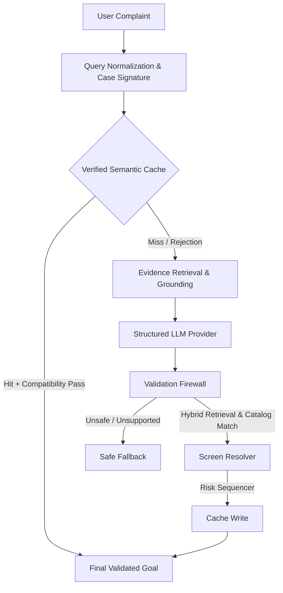

# FixGraph Architecture

## Core Flow
1. **Query & Signature**: The raw complaint is fingerprinted for intent and hardware domains.
2. **Semantic Cache**: We search a verified SQLite knowledge base. Unlike basic RAG, we apply **hard compatibility gates**. A hit must share the same hardware domain and symptom space, avoiding false positives.
3. **Structured Provider**: The LLM outputs strict JSON actions. It does *not* output URIs.
4. **Validation Firewall**: Every proposed action must map to exactly one official Samsung catalog item via hybrid dense/BM25 retrieval. Ambiguous parent menus (e.g. "Display") are penalized in favor of specific child screens (e.g. "Motion Smoothness").
5. **Risk Sequencer**: Destructive actions (like factory resets) are safely delayed to the end of the action chain.
